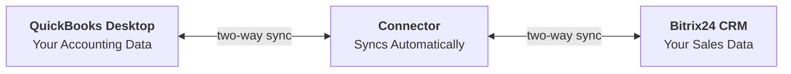
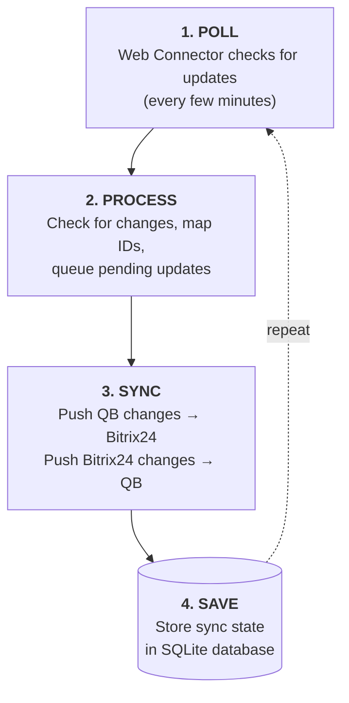
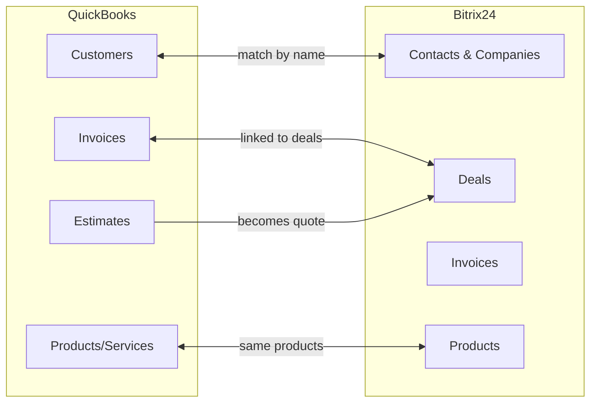
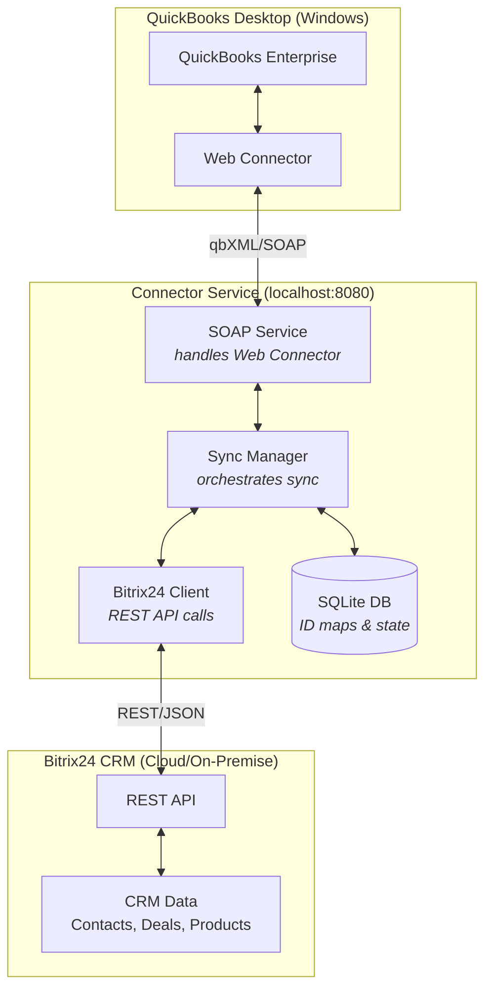

# QB-Bitrix24 Connector

A bi-directional integration connector that synchronizes data between **QuickBooks Desktop Enterprise** and **Bitrix24 CRM** (on-premise or cloud).

---

## Table of Contents

**Understand**
- [What Is This?](#what-is-this)
- [How It Works](#how-it-works)
- [What Gets Synced](#what-gets-synced)

**Get Started**
- [Prerequisites](#prerequisites)
- [Quick Start](#quick-start)
- [Configuration](#configuration)
- [Bitrix24 Setup](#bitrix24-setup)
- [QuickBooks Web Connector Setup](#quickbooks-web-connector-setup)

**Use It**
- [Running the Connector](#running-the-connector)
- [Data Mapping](#data-mapping)
- [Troubleshooting](#troubleshooting)

**Reference**
- [Technical Architecture](#technical-architecture)
- [API Reference](#api-reference)
- [QuickBooks Schema](#quickbooks-schema)
- [Field Reference](#field-reference)
- [File Structure](#file-structure)

**Appendix**
- [Example Deployment](#example-deployment)
- [Utilities](#utilities)
- [Changelog](#changelog)

---

# Understand

## What Is This?

This connector keeps your **QuickBooks Desktop** accounting data and **Bitrix24 CRM** sales data in sync automatically.



**In plain English:** When you update a customer in QuickBooks, it automatically updates in Bitrix24. When you create a deal in Bitrix24, it can create an invoice in QuickBooks. The connector keeps both systems in sync.

### Key Features

- **Bi-directional sync** - Data flows both ways between QB and Bitrix24
- **Automatic polling** - Web Connector checks for updates every few minutes
- **Incremental sync** - Only syncs records modified since last sync
- **ID tracking** - Maintains relationships between records in both systems
- **Local database** - SQLite stores sync state and ID mappings

---

## How It Works

### The Sync Process



### Two-Way Sync Explained

**QB → Bitrix24 (Polling)**:
1. Web Connector polls the connector service every N minutes
2. Connector queries QB for records modified since last sync
3. Connector pushes changes to Bitrix24 via REST API
4. ID mappings are stored for future reference

**Bitrix24 → QB (Queue-based)**:
1. Changes in Bitrix24 are queued (via webhook or manual trigger)
2. On next Web Connector poll, queued items are sent to QB
3. QB processes the qbXML requests and returns results

---

## What Gets Synced



| QuickBooks Entity | Bitrix24 Entity | Direction | Priority |
|-------------------|-----------------|-----------|----------|
| Customers | Contacts / Companies | QB ↔ Bitrix24 | HIGH |
| Vendors | Contacts (vendor type) | QB → Bitrix24 | MEDIUM |
| Items (Products/Services) | Products | QB ↔ Bitrix24 | HIGH |
| Invoices | Deals / Invoices | QB ↔ Bitrix24 | HIGH |
| Estimates | Deals (estimate stage) | QB → Bitrix24 | MEDIUM |

---

# Get Started

## Prerequisites

### Required Software

| Software | Requirement | Notes |
|----------|-------------|-------|
| **QuickBooks Desktop** | Enterprise (Pro/Premier may work) | Must be on same machine as connector |
| **Python** | 3.11+ (32-bit) | **Must be 32-bit** for QB compatibility |
| **Bitrix24** | Cloud or On-Premise | Admin access needed for webhooks |

### Network Requirements

- Connector runs on `localhost:8080`
- QuickBooks and connector must be on same machine
- Outbound HTTPS access to Bitrix24 URL required

---

## Quick Start

### Step 1: Clone the Repository

```bash
git clone https://github.com/botpros-admin/qb-bitrix-connector.git
cd qb-bitrix-connector
```

### Step 2: Install Dependencies

```bash
# Using 32-bit Python (adjust path as needed)
"C:\Program Files (x86)\Python311-32\python.exe" -m pip install spyne lxml flask requests pywin32 bitrix24-rest
```

### Step 3: Initialize Database

```bash
"C:\Program Files (x86)\Python311-32\python.exe" -c "from database import init_db; init_db()"
```

### Step 4: Configure

Edit `config.py` with your Bitrix24 webhook URL and set a password:

```python
BITRIX24_WEBHOOK = "https://your-domain.com/rest/1/your-webhook-code/"
SOAP_PASSWORD = "your-secure-password-here"  # You'll enter this in Web Connector
```

### Step 5: Start the Connector

```bash
"C:\Program Files (x86)\Python311-32\python.exe" main.py
```

Verify it's running: http://localhost:8080/status

### Step 6: Add to QuickBooks Web Connector

1. Open QuickBooks with your company file
2. Open Web Connector: **File → App Management → Update Web Services**
3. Click **Add an Application** → browse to `qb_bitrix_connector.qwc`
4. Authorize when prompted by QuickBooks
5. Enter your `SOAP_PASSWORD` in the Password field
6. Click **Update Selected** to run first sync

---

## Configuration

### config.py

```python
# QuickBooks Settings
QB_APP_NAME = "QB-Bitrix24 Connector"
QB_COMPANY_FILE = ""  # Leave empty to use currently open company file

# Bitrix24 Settings
BITRIX24_URL = "https://your-bitrix24-domain.com"
BITRIX24_WEBHOOK = "https://your-bitrix24-domain.com/rest/1/your-webhook-code/"

# Web Connector SOAP Service
SOAP_HOST = "127.0.0.1"
SOAP_PORT = 8080
SOAP_USERNAME = "qbconnector"
SOAP_PASSWORD = "your-secure-password-here"  # CHANGE THIS!

# Sync Settings
SYNC_INTERVAL_SECONDS = 300  # Controlled by Web Connector, not this setting

# Database
DATABASE_PATH = "sync_state.db"

# Logging
LOG_FILE = "connector.log"
LOG_LEVEL = "INFO"
```

### Important Notes

1. **SOAP_PASSWORD**: Change from default! This is what you enter in Web Connector.
2. **BITRIX24_WEBHOOK**: Get this from Bitrix24 (see next section).
3. **Paths**: Use forward slashes or escaped backslashes.

---

## Bitrix24 Setup

### Creating an Inbound Webhook (Required)

1. Log into Bitrix24 as administrator
2. Go to: **Developer resources → Other → Inbound webhook**
3. Configure:
   - **Name**: `QB Connector`
   - **Permissions**: Select `crm` (required), `catalog` (recommended), `user` (optional)
4. Click **Save**
5. Copy the webhook URL → paste into `config.py` as `BITRIX24_WEBHOOK`

| Scope | Purpose | Required |
|-------|---------|----------|
| `crm` | Contacts, Companies, Deals, Products | Yes |
| `catalog` | Product catalog access | Recommended |
| `user` | User info for SalesRep mapping | Optional |

### Creating an Outbound Webhook (Optional)

For real-time sync from Bitrix24 → QB (instead of waiting for next poll):

1. Go to: **Developer resources → Other → Outbound webhook**
2. Configure:
   - **Handler URL**: `http://YOUR_PUBLIC_IP:8080/bitrix24/webhook`
   - **Events**: `ONCRMCONTACTADD`, `ONCRMCONTACTUPDATE`, `ONCRMCOMPANYADD`, etc.

**Note**: Requires your connector to be internet-accessible (port forwarding or tunnel).

---

## QuickBooks Web Connector Setup

### 1. Start the Connector First

```bash
"C:\Program Files (x86)\Python311-32\python.exe" main.py
```

### 2. Open QuickBooks and Web Connector

- Open QuickBooks Enterprise with your company file
- Open Web Connector: **File → App Management → Update Web Services**

### 3. Add the Application

1. Click **Add an Application**
2. Browse to `qb_bitrix_connector.qwc` in your project folder
3. Click **Open**

### 4. Authorize Access

When QuickBooks prompts:
1. Select **"Yes, always allow access even if QuickBooks is not running"**
2. Click **Continue**

### 5. Enter Password

1. Find "QB-Bitrix24 Connector" in the list
2. Click the **Password** field
3. Enter your `SOAP_PASSWORD` from config.py
4. Press Enter

### 6. Configure Auto-Run (Optional)

1. Check the checkbox next to the connector
2. Set **Auto-Run** interval (e.g., 5 minutes)
3. Or manually click **Update Selected** to sync

---

# Use It

## Running the Connector

### Option 1: Manual Start

```bash
"C:\Program Files (x86)\Python311-32\python.exe" main.py
```

### Option 2: Batch File

Double-click `run_connector.bat`

### Option 3: Windows Service (Production)

```bash
# Install nssm from https://nssm.cc/
nssm install QBBitrixConnector "C:\Program Files (x86)\Python311-32\python.exe" "C:\path\to\main.py"
nssm start QBBitrixConnector
```

### Verify Running

- Status page: http://localhost:8080/status
- WSDL: http://localhost:8080/soap/?wsdl

---

## Data Mapping

### Customer ↔ Contact/Company

| QB Field | Bitrix24 Field | Notes |
|----------|----------------|-------|
| `Name` | `NAME` / `TITLE` | Split for contacts |
| `FirstName` | `NAME` | Contact first name |
| `LastName` | `LAST_NAME` | Contact last name |
| `CompanyName` | `COMPANY_TITLE` | Creates Company |
| `Email` | `EMAIL` | Array in Bitrix24 |
| `Phone` | `PHONE` | Array in Bitrix24 |
| `BillAddress.*` | `ADDRESS_*` | Street, City, State, ZIP |
| `SalesRepRef` | `ASSIGNED_BY_ID` | Sales rep mapping |

### Invoice ↔ Deal

| QB Field | Bitrix24 Field | Notes |
|----------|----------------|-------|
| `RefNumber` | `TITLE` | "Invoice {RefNumber}" |
| `TxnDate` | `DATE_CREATE` | Invoice date |
| `DueDate` | `CLOSEDATE` | Due date |
| `Subtotal` | `OPPORTUNITY` | Deal amount |
| `IsPaid` | `STAGE_ID` | WON if paid |
| `CustomerRef` | `COMPANY_ID` | Linked via ID map |

### Item ↔ Product

| QB Field | Bitrix24 Field | Notes |
|----------|----------------|-------|
| `Name` | `NAME` | Product name |
| `FullName` | `CODE` | Full hierarchical name |
| `SalesDesc` | `DESCRIPTION` | Description |
| `SalesPrice` | `PRICE` | Price |
| `IsActive` | `ACTIVE` | Active status |

---

## Troubleshooting

### "Service Unavailable" in Web Connector

**Cause**: Connector not running or wrong port.

**Fix**:
1. Check connector is running: http://localhost:8080/status
2. Check port: `netstat -an | findstr 8080`
3. Check logs: `connector.log`

### "No Valid User" Authentication Error

**Cause**: Password mismatch.

**Fix**:
1. Verify `SOAP_PASSWORD` in config.py
2. Re-enter password in Web Connector

### Python 32-bit vs 64-bit Error

**Cause**: Using 64-bit Python with 32-bit QuickBooks.

**Fix**: Install 32-bit Python from python.org (Windows installer x86).

### Bitrix24 API Errors

**Cause**: Invalid webhook or missing permissions.

**Fix**:
1. Test webhook: Visit `{WEBHOOK_URL}profile` in browser
2. Verify `crm` scope is enabled
3. Check webhook hasn't expired

### "Empty Response" from QuickBooks

**Cause**: Company file not open.

**Fix**: Ensure QuickBooks is open with the correct company file.

### Checking Logs

```bash
# View recent log entries
powershell Get-Content connector.log -Tail 50
```

---

# Reference

## Technical Architecture



### Components

| Component | File | Purpose |
|-----------|------|---------|
| SOAP Service | `webconnector_service.py` | Handles QB Web Connector protocol |
| Sync Manager | `sync_manager.py` | Orchestrates sync logic |
| qbXML Builder | `qbxml_builder.py` | Builds QB requests |
| qbXML Parser | `qbxml_parser.py` | Parses QB responses |
| Bitrix24 Client | `bitrix24_client.py` | REST API calls to Bitrix24 |
| Database | `database.py` | SQLite for sync state |

---

## API Reference

### Status Endpoint

```
GET http://localhost:8080/status
```

```json
{
  "status": "running",
  "version": "1.0.0",
  "active_sessions": 0,
  "id_mappings": 150,
  "syncs_last_24h": 48,
  "pending_queue": 0,
  "bitrix24_configured": true
}
```

### SOAP Endpoints (for Web Connector)

```
WSDL: http://localhost:8080/soap/?wsdl
Endpoint: http://localhost:8080/soap/
```

| Method | Purpose |
|--------|---------|
| `authenticate()` | Authenticate Web Connector session |
| `sendRequestXML()` | Get next qbXML request |
| `receiveResponseXML()` | Process QB response |
| `getLastError()` | Get last error message |
| `closeConnection()` | Close session |

### Bitrix24 Webhook Endpoint

```
POST http://localhost:8080/bitrix24/webhook
```

Receives event notifications from Bitrix24 outbound webhooks.

### Schema Export

```
GET http://localhost:8080/schema
```

Returns complete QuickBooks schema as JSON.

---

## QuickBooks Schema

The connector supports **35 QuickBooks entities** with **719+ fields** based on qbXML SDK 16.0.

### List Entities (ID: ListID)

| Entity | Fields | Description |
|--------|--------|-------------|
| **Customer** | 57 | Customers, jobs, sub-customers |
| **Vendor** | 49 | Vendors/suppliers |
| **ItemInventory** | 35 | Inventory items with tracking |
| **ItemService** | 18 | Service items |
| **ItemNonInventory** | 18 | Non-inventory items |
| **Account** | 25 | Chart of Accounts |
| **Employee** | 34 | Employees |
| **Terms** | 13 | Payment terms (Net 30, etc.) |
| **SalesRep** | 7 | Sales representatives |

### Transaction Entities (ID: TxnID)

| Entity | Fields | Description |
|--------|--------|-------------|
| **Invoice** | 46 | Sales invoices |
| **Estimate** | 34 | Quotes/estimates |
| **SalesOrder** | 38 | Sales orders |
| **PurchaseOrder** | 38 | Purchase orders |
| **Bill** | 26 | Vendor bills |
| **ReceivePayment** | 21 | Customer payments |

### Data Types

| Type | Format | Example |
|------|--------|---------|
| `IDTYPE` | QB unique ID | `80000001-1234567890` |
| `STRTYPE` | String | Variable length |
| `BOOLTYPE` | Boolean | `true` / `false` |
| `AMTTYPE` | Money | `1234.56` (2 decimals) |
| `DATETYPE` | Date | `2025-11-26` |
| `REF` | Reference | ListID + FullName |

---

## Field Reference

### Customer Entity (57 Fields)

<details>
<summary>Click to expand full field list</summary>

```
Core Identifiers:
  ListID              IDTYPE          [READONLY] Unique QB identifier
  TimeCreated         DATETIMETYPE    [READONLY] Record creation timestamp
  TimeModified        DATETIMETYPE    [READONLY] Last modification
  EditSequence        STRTYPE         [READONLY] Revision number

Basic Info:
  Name                STRTYPE(41)     [REQUIRED] Short name (unique)
  FullName            STRTYPE(209)    [READONLY] Full hierarchical name
  IsActive            BOOLTYPE        Active/Inactive status

Company/Contact:
  CompanyName         STRTYPE(41)     Company name
  FirstName           STRTYPE(25)     Contact first name
  LastName            STRTYPE(25)     Contact last name
  JobTitle            STRTYPE(41)     Job title

Communication:
  Phone               STRTYPE(21)     Primary phone
  Email               STRTYPE(1023)   Email address
  Fax                 STRTYPE(21)     Fax number

Addresses:
  BillAddress         ADDRESS         Billing address (nested)
  ShipAddress         ADDRESS         Shipping address (nested)

Financial:
  Balance             AMTTYPE         [READONLY] Current balance
  CreditLimit         AMTTYPE         Credit limit

References:
  CustomerTypeRef     REF             Customer type category
  TermsRef            REF             Payment terms
  SalesRepRef         REF             Sales representative
```

</details>

### Invoice Entity (46 Fields)

<details>
<summary>Click to expand full field list</summary>

```
Core Identifiers:
  TxnID               IDTYPE          [READONLY] Transaction ID
  TimeCreated         DATETIMETYPE    [READONLY] Creation timestamp
  TimeModified        DATETIMETYPE    [READONLY] Last modification
  RefNumber           STRTYPE(11)     Invoice number

Dates:
  TxnDate             DATETYPE        Invoice date
  DueDate             DATETYPE        Due date
  ShipDate            DATETYPE        Ship date

Totals:
  Subtotal            AMTTYPE         [READONLY] Subtotal
  SalesTaxTotal       AMTTYPE         [READONLY] Tax total
  BalanceRemaining    AMTTYPE         [READONLY] Balance due

Flags:
  IsPending           BOOLTYPE        Is pending
  IsPaid              BOOLTYPE        [READONLY] Is paid

References:
  CustomerRef         REF             [REQUIRED] Customer
  SalesRepRef         REF             Sales rep
  TermsRef            REF             Payment terms

Line Items:
  InvoiceLineRet      LIST            Invoice line items
```

</details>

---

## File Structure

```
qb-bitrix-connector/
├── main.py                    # Entry point - starts the service
├── config.py                  # Configuration settings
├── webconnector_service.py    # SOAP service for Web Connector
├── sync_manager.py            # Sync orchestration
├── qbxml_builder.py           # Builds qbXML requests
├── qbxml_parser.py            # Parses qbXML responses
├── bitrix24_client.py         # Bitrix24 REST API client
├── bitrix24_webhook_handler.py # Incoming webhook handler
├── database.py                # SQLite database
├── qb_schema_extractor.py     # QB schema (35 entities, 700+ fields)
├── data_discovery.py          # Bitrix24 data discovery
├── qb_bitrix_connector.qwc    # Web Connector config file
├── run_connector.bat          # Windows batch file
├── sync_state.db              # SQLite database (created on run)
├── connector.log              # Log file (created on run)
└── README.md                  # This file
```

---

# Appendix

## Example Deployment

This connector was developed and tested in the following environment:

| Component | Details |
|-----------|---------|
| **Machine** | Dell OptiPlex 3090, Windows 10 |
| **QuickBooks** | Enterprise Solutions - Contractor Edition 24.0 (32-bit) |
| **Python** | 3.11.9 (32-bit) |
| **Bitrix24** | On-Premise at hartzell.app |
| **Data** | 560 Contacts, 81 Companies, 74 Deals, 8 Products |

### Bitrix24 Data Structure (Example)

| Entity | Count | Maps To |
|--------|-------|---------|
| Contacts | 560 | Customer |
| Companies | 81 | Customer (CompanyName) |
| Leads | 716 | Pre-customer |
| Deals | 74 | Invoice / Estimate |
| Products | 8 | ItemService |
| Users | 41 | SalesRep |

---

## Utilities

### Schema Extractor

View all QuickBooks entities and fields:

```bash
python qb_schema_extractor.py
```

### Data Discovery

Analyze current Bitrix24 data:

```bash
python data_discovery.py
```

### Test Bitrix24 Connection

```python
from bitrix24_client import Bitrix24Client
client = Bitrix24Client('YOUR_WEBHOOK_URL')
print(client.get_contacts())
```

---

## License

MIT License - See LICENSE file for details.

## Support

GitHub Issues: https://github.com/botpros-admin/qb-bitrix-connector/issues

---

## Changelog

### v1.0.0 (2025-11-26)
- Initial release
- QuickBooks Desktop Enterprise 24.0 support
- Bitrix24 on-premise support
- Bi-directional sync for customers, items, invoices
- SQLite-based sync state tracking
- Web Connector SOAP interface
- Complete qbXML schema (35 entities, 719 fields)
