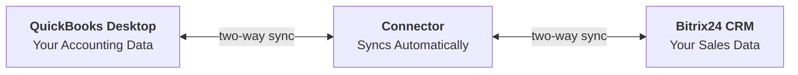
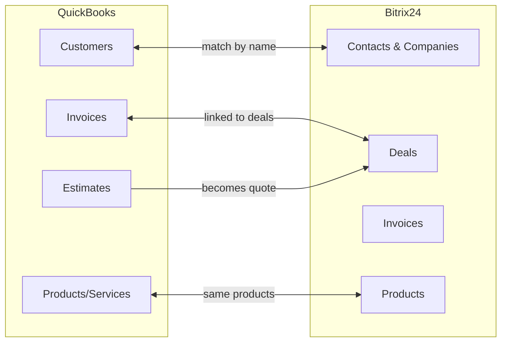
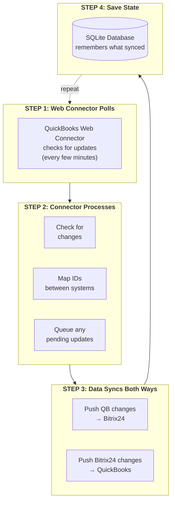
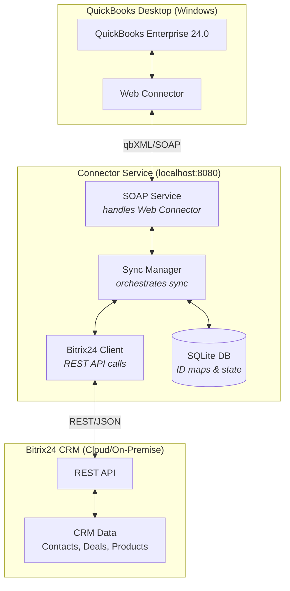

# QB-Bitrix24 Connector

A bi-directional integration connector that synchronizes data between **QuickBooks Desktop Enterprise** and **Bitrix24 CRM** (on-premise or cloud).

## Table of Contents

- [How It Works (Visual Guide)](#how-it-works-visual-guide)
- [Overview](#overview)
- [Live Data Analysis](#live-data-analysis)
- [QuickBooks Schema Reference](#quickbooks-schema-reference)
- [Architecture](#architecture)
- [Environment Details](#environment-details)
- [Prerequisites](#prerequisites)
- [Installation](#installation)
- [Configuration](#configuration)
- [Bitrix24 Setup](#bitrix24-setup)
- [QuickBooks Web Connector Setup](#quickbooks-web-connector-setup)
- [Running the Connector](#running-the-connector)
- [Data Mapping](#data-mapping)
- [Field Reference](#field-reference)
- [Troubleshooting](#troubleshooting)
- [File Structure](#file-structure)
- [API Reference](#api-reference)

---

## How It Works (Visual Guide)

### The Big Picture



**In plain English:** When you update a customer in QuickBooks, it automatically updates in Bitrix24. When you create a deal in Bitrix24, it can create an invoice in QuickBooks. The connector keeps both systems in sync.

---

### What Syncs With What?



---

### The Sync Process (Step by Step)



---

### Technical Architecture



---

## Overview

This connector enables automated synchronization between QuickBooks Desktop Enterprise and Bitrix24 CRM. It uses the **QuickBooks Web Connector** (SOAP/qbXML) to communicate with QuickBooks and the **Bitrix24 REST API** (webhooks) to communicate with Bitrix24.

### Key Features

- **Bi-directional sync**: Data flows both from QB to Bitrix24 and from Bitrix24 to QB
- **Polling-based**: Web Connector polls the connector service at configurable intervals
- **Entity mapping**: Tracks ID relationships between QB and Bitrix24 records
- **Incremental sync**: Only syncs records modified since the last sync
- **SQLite database**: Stores sync state, ID mappings, and queue items locally
- **Complete qbXML support**: Access to all 35+ QuickBooks entities with 700+ fields

### What Gets Synced

| QuickBooks Entity | Bitrix24 Entity | Direction | Priority |
|-------------------|-----------------|-----------|----------|
| Customers | Contacts / Companies | QB ↔ Bitrix24 | HIGH |
| Vendors | Contacts (vendor type) | QB → Bitrix24 | MEDIUM |
| Items (Products/Services) | Products | QB ↔ Bitrix24 | HIGH |
| Invoices | Deals / Invoices | QB ↔ Bitrix24 | HIGH |
| Estimates | Deals (estimate stage) | QB → Bitrix24 | MEDIUM |

---

## Live Data Analysis

### Bitrix24 Instance Data (as of 2025-11-26)

Based on actual data discovery from the connected Bitrix24 instance at `hartzell.app`:

| Bitrix24 Entity | Record Count | Maps To QB | Sync Priority |
|-----------------|--------------|------------|---------------|
| **Contacts** | 560 | Customer | HIGH |
| **Companies** | 81 | Customer (CompanyName) | HIGH |
| **Leads** | 716 | Pre-customer (conversion) | LOW |
| **Deals** | 74 | Invoice / Estimate | HIGH |
| **Invoices** | 4 | Invoice | HIGH |
| **Quotes** | 0 | Estimate | MEDIUM |
| **Products** | 8 | ItemService | HIGH |
| **Activities** | 2,523 | No QB equivalent | N/A |
| **Users** | 41 | SalesRep | LOW |

### Deal Pipeline Structure

The Bitrix24 instance has 3 deal pipelines:

1. **Default Pipeline** (Sales)
   - NEW → IN_PROCESS → FINAL_INVOICE → WON / LOSE

2. **Work Order Pipeline**
   - Custom stages for work orders

3. **Subcontractor Project Pipeline**
   - Custom stages for subcontractor management

### Key Data Fields in Use

**Contacts (560 records)**
- NAME, LAST_NAME (populated)
- PHONE, EMAIL (multi-value arrays)
- COMPANY_ID (links to Companies)
- ASSIGNED_BY_ID (links to Users)
- SOURCE_ID, TYPE_ID (categorization)

**Companies (81 records)**
- TITLE (company name)
- ADDRESS, ADDRESS_CITY, ADDRESS_PROVINCE, ADDRESS_POSTAL_CODE
- CURRENCY_ID (multi-currency support)
- INDUSTRY (business type)

**Deals (74 records)**
- TITLE, OPPORTUNITY (deal value)
- STAGE_ID (pipeline stage)
- COMPANY_ID, CONTACT_ID (relationships)
- ASSIGNED_BY_ID (sales rep)
- CATEGORY_ID (pipeline)

**Products (8 records)**
- NAME, CODE
- PRICE, CURRENCY_ID
- SECTION_ID (category)

---

## QuickBooks Schema Reference

The connector supports **35 QuickBooks entities** with **719+ fields** based on qbXML SDK 16.0 for QuickBooks Enterprise.

### List Entities (ID: ListID)

| Entity | Fields | Description |
|--------|--------|-------------|
| **Customer** | 57 | Customers, jobs, sub-customers |
| **Vendor** | 49 | Vendors/suppliers |
| **ItemInventory** | 35 | Inventory items with tracking |
| **ItemService** | 18 | Service items |
| **ItemNonInventory** | 18 | Non-inventory items |
| **ItemOtherCharge** | 17 | Shipping, handling charges |
| **ItemDiscount** | 16 | Discount items |
| **ItemGroup** | 15 | Bundled items |
| **ItemSubtotal** | 11 | Subtotal items |
| **ItemSalesTax** | 14 | Tax items |
| **ItemSalesTaxGroup** | 11 | Combined tax groups |
| **Account** | 25 | Chart of Accounts |
| **Class** | 10 | Job costing classes |
| **Employee** | 34 | Employees |
| **Terms** | 13 | Payment terms (Net 30, etc.) |
| **CustomerType** | 9 | Customer categories |
| **VendorType** | 9 | Vendor categories |
| **JobType** | 9 | Job categories |
| **PaymentMethod** | 7 | Payment methods |
| **ShipMethod** | 6 | Shipping methods |
| **SalesTaxCode** | 10 | Tax codes |
| **PriceLevel** | 10 | Price levels |
| **SalesRep** | 7 | Sales representatives |
| **Currency** | 11 | Multi-currency |
| **InventorySite** | 14 | Inventory locations (Enterprise) |
| **UnitOfMeasureSet** | 10 | Units of measure |

### Transaction Entities (ID: TxnID)

| Entity | Fields | Description |
|--------|--------|-------------|
| **Invoice** | 46 | Sales invoices |
| **Estimate** | 34 | Quotes/estimates |
| **SalesOrder** | 38 | Sales orders |
| **PurchaseOrder** | 38 | Purchase orders |
| **Bill** | 26 | Vendor bills |
| **ReceivePayment** | 21 | Customer payments |
| **CreditMemo** | 36 | Credit memos |
| **TimeTracking** | 17 | Time entries |
| **Company** | 18 | Company info |

### QuickBooks Data Types

| Type | Description | Format | Python Type |
|------|-------------|--------|-------------|
| `IDTYPE` | QuickBooks unique ID | `80000001-1234567890` | str |
| `STRTYPE` | String value | Variable length | str |
| `BOOLTYPE` | Boolean | `true` / `false` | bool |
| `INTTYPE` | Integer | Whole number | int |
| `FLOATTYPE` | Float | Decimal number | float |
| `AMTTYPE` | Money | `XXXX.XX` (2 decimals) | Decimal |
| `PRICETYPE` | Price | `XXXX.XXXXX` (5 decimals) | Decimal |
| `PERCENTTYPE` | Percentage | `XX.XX` | Decimal |
| `QUANTYPE` | Quantity | `XXXX.XXXXX` (5 decimals) | Decimal |
| `DATETYPE` | Date | `YYYY-MM-DD` | date |
| `DATETIMETYPE` | DateTime | `YYYY-MM-DDTHH:MM:SS` | datetime |
| `DURATIONTYPE` | Duration | `PT8H30M0S` | timedelta |
| `GUIDTYPE` | External GUID | `{XXXXXXXX-XXXX-...}` | str |
| `ENUMTYPE` | Enumeration | Predefined values | str |
| `REF` | Reference | ListID + FullName | dict |
| `ADDRESS` | Address block | Addr1-5, City, State, etc. | dict |
| `LIST` | Repeating items | Can contain multiple | list |

---

## Architecture

```
┌─────────────────────┐                              ┌─────────────────────┐
│                     │                              │                     │
│  QuickBooks Desktop │                              │  Bitrix24 CRM       │
│  Enterprise 24.0    │                              │  (On-Premise/Cloud) │
│                     │                              │                     │
└──────────┬──────────┘                              └──────────┬──────────┘
           │                                                    │
           │ qbXML/SOAP                              REST API   │
           │ (via Web Connector)                    (webhooks)  │
           │                                                    │
           ▼                                                    ▼
┌──────────────────────────────────────────────────────────────────────────┐
│                                                                          │
│                    QB-Bitrix24 Connector Service                         │
│                    (Python/Flask on localhost:8080)                      │
│                                                                          │
│  ┌─────────────────┐  ┌─────────────────┐  ┌─────────────────────────┐  │
│  │ SOAP Service    │  │ Sync Manager    │  │ Bitrix24 Client         │  │
│  │ (Web Connector) │  │ (Orchestration) │  │ (REST API)              │  │
│  └─────────────────┘  └─────────────────┘  └─────────────────────────┘  │
│                                                                          │
│  ┌─────────────────┐  ┌─────────────────┐  ┌─────────────────────────┐  │
│  │ qbXML Builder   │  │ qbXML Parser    │  │ SQLite Database         │  │
│  │ (Request Gen)   │  │ (Response Parse)│  │ (Sync State/ID Maps)    │  │
│  └─────────────────┘  └─────────────────┘  └─────────────────────────┘  │
│                                                                          │
└──────────────────────────────────────────────────────────────────────────┘
```

### Data Flow

```
                    ┌─────────────────────────────────────┐
                    │         SYNC FLOW DIAGRAM           │
                    └─────────────────────────────────────┘

    BITRIX24                    CONNECTOR                    QUICKBOOKS
    ────────                    ─────────                    ──────────

    560 Contacts ─────────────► Customer Sync ◄───────────── Customers
     81 Companies ────────────►     ↑↓        ◄───────────── (with jobs)
                                    │
     74 Deals ────────────────► Invoice/Est Sync ◄────────── Invoices
      4 Invoices ─────────────►     ↑↓         ◄────────── Estimates
                                    │
      8 Products ─────────────► Item Sync ◄───────────────── Items
                                    ↑↓                       (Service)
                                    │
     41 Users ────────────────► SalesRep Map ◄────────────── SalesReps
                                    │
                            ┌───────┴───────┐
                            │ SQLite DB     │
                            │ - ID mappings │
                            │ - Sync state  │
                            │ - Queue items │
                            └───────────────┘
```

### How Sync Works

1. **QB → Bitrix24 (Polling)**:
   - Web Connector polls the connector service every N minutes
   - Connector queries QB for records modified since last sync
   - Connector pushes changes to Bitrix24 via REST API
   - ID mappings are stored for future reference

2. **Bitrix24 → QB (Queue-based)**:
   - Changes in Bitrix24 are queued (via outbound webhook or manual trigger)
   - On next Web Connector poll, queued items are sent to QB
   - QB processes the qbXML requests and returns results

---

## Environment Details

This connector was developed and tested in the following environment:

### Server Machine

| Property | Value |
|----------|-------|
| **Hostname** | Dell OptiPlex 3090 |
| **Type** | Physical Desktop (not a VM) |
| **OS** | Windows 10 (Build 19045.6456) |
| **Public IP** | 76.8.89.254 |
| **Role** | QuickBooks host + Connector service |

### QuickBooks Installation

| Property | Value |
|----------|-------|
| **Product** | QuickBooks Enterprise Solutions - Contractor Edition |
| **Version** | 24.0 (also has 22.0 installed) |
| **Install Path** | `C:\Program Files (x86)\Intuit\QuickBooks Enterprise Solutions 24.0` |
| **Architecture** | 32-bit |
| **Web Connector** | Included with QuickBooks |

### Bitrix24 Instance

| Property | Value |
|----------|-------|
| **URL** | https://hartzell.app |
| **Type** | On-Premise (hosted on AWS) |
| **API** | REST API via Inbound Webhook |
| **Data** | 560 Contacts, 81 Companies, 74 Deals, 8 Products |

### Python Environment

| Property | Value |
|----------|-------|
| **Version** | Python 3.11.9 |
| **Architecture** | 32-bit (required for QB COM interface) |
| **Install Path** | `C:\Program Files (x86)\Python311-32` |

---

## Prerequisites

### Required Software

1. **QuickBooks Desktop Enterprise** (Pro/Premier may work but untested)
   - Must be installed on the same machine as the connector
   - Web Connector must be available (included with QB)

2. **Python 3.11+ (32-bit)** - IMPORTANT: Must be 32-bit for QuickBooks compatibility
   - Download from: https://www.python.org/downloads/windows/
   - Select "Windows installer (32-bit)"
   - Check "Add Python to PATH" during installation

3. **Bitrix24** (Cloud or On-Premise)
   - Must have admin access to create webhooks
   - CRM module required

### Network Requirements

- Connector service runs on `localhost:8080` by default
- QuickBooks and connector must be on the same machine
- Outbound HTTPS access to Bitrix24 URL required

---

## Installation

### 1. Clone the Repository

```bash
git clone https://github.com/botpros-admin/qb-bitrix-connector.git
cd qb-bitrix-connector
```

### 2. Install Python Dependencies

```bash
# Using 32-bit Python (adjust path as needed)
"C:\Program Files (x86)\Python311-32\python.exe" -m pip install spyne lxml flask requests pywin32 bitrix24-rest
```

**Required packages:**
- `spyne` - SOAP server framework for Web Connector interface
- `lxml` - XML parsing for qbXML
- `flask` - Web framework for HTTP endpoints
- `requests` - HTTP client for Bitrix24 API
- `pywin32` - Windows COM interface (for future direct QB access)
- `bitrix24-rest` - Bitrix24 REST API client

### 3. Initialize the Database

```bash
"C:\Program Files (x86)\Python311-32\python.exe" -c "from database import init_db; init_db()"
```

---

## Configuration

### config.py

Edit `config.py` with your settings:

```python
"""
Configuration for QB-Bitrix24 Connector
"""

# QuickBooks Settings
QB_APP_NAME = "QB-Bitrix24 Connector"
QB_COMPANY_FILE = ""  # Leave empty to use currently open company file

# Bitrix24 Settings
BITRIX24_URL = "https://your-bitrix24-domain.com"
BITRIX24_WEBHOOK = "https://your-bitrix24-domain.com/rest/1/your-webhook-code/"

# Web Connector SOAP Service Settings
SOAP_HOST = "127.0.0.1"
SOAP_PORT = 8080
SOAP_USERNAME = "qbconnector"
SOAP_PASSWORD = "your-secure-password-here"  # CHANGE THIS!

# Sync Settings
SYNC_INTERVAL_SECONDS = 300  # Controlled by Web Connector, not this setting

# Database for tracking sync state
DATABASE_PATH = "C:/Users/max/qb-bitrix-connector/sync_state.db"

# Logging
LOG_FILE = "C:/Users/max/qb-bitrix-connector/connector.log"
LOG_LEVEL = "INFO"
```

### Important Configuration Notes

1. **SOAP_PASSWORD**: Change this from the default! This is the password you'll enter in Web Connector.

2. **BITRIX24_WEBHOOK**: This is the inbound webhook URL from Bitrix24 (see Bitrix24 Setup below).

3. **Database paths**: Use forward slashes or escaped backslashes in paths.

---

## Bitrix24 Setup

### Creating an Inbound Webhook (Required)

The inbound webhook allows the connector to read/write data to Bitrix24.

1. Log into Bitrix24 as an administrator
2. Navigate to: **Developer resources → Other → Inbound webhook**
3. Configure the webhook:
   - **Name**: `QB Connector Inbound (API Access)`
   - **Permissions/Scopes**: Select at minimum:
     - `crm` - CRM access (contacts, companies, deals, products)
     - `catalog` - Product catalog (optional, for inventory sync)
     - `user` - User information (optional)
4. Click **Save**
5. Copy the webhook URL (looks like `https://your-domain.com/rest/1/abc123xyz/`)
6. Paste into `config.py` as `BITRIX24_WEBHOOK`

### Webhook Permissions Reference

| Scope | Purpose | Required |
|-------|---------|----------|
| `crm` | Contacts, Companies, Deals, Products | Yes |
| `catalog` | Product catalog access | Recommended |
| `user` | User info for SalesRep mapping | Optional |
| `task` | Task management | Optional |

### Creating an Outbound Webhook (Optional)

The outbound webhook enables real-time sync from Bitrix24 to QuickBooks. **This is optional** - without it, Bitrix24 changes sync on the next polling interval.

**Requirements for outbound webhooks:**
- Your connector must be accessible from the internet
- Requires port forwarding or a tunnel service (ngrok, Cloudflare Tunnel)

**Setup:**
1. Navigate to: **Developer resources → Other → Outbound webhook**
2. Configure:
   - **Name**: `QB Connector Outbound (Event Notifications)`
   - **Handler URL**: `http://YOUR_PUBLIC_IP:8080/bitrix24/webhook`
   - **Events**: Select relevant events:
     - `ONCRMCONTACTADD`
     - `ONCRMCONTACTUPDATE`
     - `ONCRMCOMPANYADD`
     - `ONCRMCOMPANYUPDATE`
     - `ONCRMDEALADD`
     - `ONCRMDEALUPDATE`

---

## QuickBooks Web Connector Setup

### 1. Locate the QWC File

The Web Connector configuration file is at:
```
C:\Users\max\qb-bitrix-connector\qb_bitrix_connector.qwc
```

### 2. Start the Connector Service

Before adding to Web Connector, the service must be running:

```bash
# Option 1: Run directly
"C:\Program Files (x86)\Python311-32\python.exe" C:\Users\max\qb-bitrix-connector\main.py

# Option 2: Use the batch file
C:\Users\max\qb-bitrix-connector\run_connector.bat
```

Verify it's running by visiting: http://localhost:8080/status

### 3. Open QuickBooks and Web Connector

1. Open **QuickBooks Enterprise** with your company file
2. Open **Web Connector**:
   - In QuickBooks: **File → App Management → Update Web Services**
   - Or search "QuickBooks Web Connector" in Windows Start menu

### 4. Add the Application

1. In Web Connector, click **"Add an Application"**
2. Browse to: `C:\Users\max\qb-bitrix-connector\qb_bitrix_connector.qwc`
3. Click **Open**

### 5. Authorize in QuickBooks

When prompted by QuickBooks:
1. Select **"Yes, always allow access even if QuickBooks is not running"**
2. Click **Continue**

### 6. Enter Password

1. In Web Connector, find "QB-Bitrix24 Connector" in the list
2. Click the **Password** field
3. Enter the password from `config.py` (`SOAP_PASSWORD`)
4. Press Enter to save

### 7. Configure Auto-Run (Optional)

1. Check the checkbox next to "QB-Bitrix24 Connector"
2. Set **"Auto-Run"** interval (e.g., every 5 minutes)
3. Or manually click **"Update Selected"** to run sync

---

## Running the Connector

### Manual Start

```bash
"C:\Program Files (x86)\Python311-32\python.exe" C:\Users\max\qb-bitrix-connector\main.py
```

### Using Batch File

Double-click `run_connector.bat`

### As a Windows Service (Production)

For production deployment, consider running as a Windows service using `nssm` or similar:

```bash
# Install nssm from https://nssm.cc/
nssm install QBBitrixConnector "C:\Program Files (x86)\Python311-32\python.exe" "C:\Users\max\qb-bitrix-connector\main.py"
nssm start QBBitrixConnector
```

### Verify Running

- Web UI: http://localhost:8080
- Status API: http://localhost:8080/status
- WSDL: http://localhost:8080/soap/?wsdl

---

## Data Mapping

### QuickBooks Customer ↔ Bitrix24 Contact/Company

| QB Field | Bitrix24 Field | Type | Notes |
|----------|----------------|------|-------|
| `ListID` | `SOURCE_DESCRIPTION` | IDTYPE | Stored for mapping |
| `Name` | `NAME` / `TITLE` | STRTYPE(41) | Split for contacts |
| `FirstName` | `NAME` | STRTYPE(25) | Contact first name |
| `LastName` | `LAST_NAME` | STRTYPE(25) | Contact last name |
| `CompanyName` | `COMPANY_TITLE` | STRTYPE(41) | Creates Company |
| `Email` | `EMAIL` | STRTYPE(1023) | Array in Bitrix24 |
| `Phone` | `PHONE` | STRTYPE(21) | Array in Bitrix24 |
| `BillAddress.Addr1` | `ADDRESS` | ADDRESS | Street address |
| `BillAddress.City` | `ADDRESS_CITY` | STRTYPE(31) | City |
| `BillAddress.State` | `ADDRESS_PROVINCE` | STRTYPE(21) | State/Province |
| `BillAddress.PostalCode` | `ADDRESS_POSTAL_CODE` | STRTYPE(13) | ZIP/Postal |
| `SalesRepRef` | `ASSIGNED_BY_ID` | REF | Sales rep mapping |
| `CustomerTypeRef` | `TYPE_ID` | REF | Category |
| `Balance` | N/A | AMTTYPE | Read-only in QB |
| `CreditLimit` | N/A | AMTTYPE | No Bitrix24 equivalent |

### QuickBooks Invoice ↔ Bitrix24 Deal

| QB Field | Bitrix24 Field | Type | Notes |
|----------|----------------|------|-------|
| `TxnID` | `COMMENTS` | IDTYPE | Stored for mapping |
| `RefNumber` | `TITLE` | STRTYPE(11) | "Invoice {RefNumber}" |
| `TxnDate` | `DATE_CREATE` | DATETYPE | Invoice date |
| `DueDate` | `CLOSEDATE` | DATETYPE | Due date |
| `Subtotal` | `OPPORTUNITY` | AMTTYPE | Deal amount |
| `BalanceRemaining` | N/A | AMTTYPE | Calculated field |
| `IsPaid` | `STAGE_ID` | BOOLTYPE | WON if paid |
| `CustomerRef` | `COMPANY_ID` | REF | Linked via ID map |
| `SalesRepRef` | `ASSIGNED_BY_ID` | REF | Sales rep |
| `InvoiceLineRet` | Product rows | LIST | Line items |

### QuickBooks Item ↔ Bitrix24 Product

| QB Field | Bitrix24 Field | Type | Notes |
|----------|----------------|------|-------|
| `ListID` | `XML_ID` | IDTYPE | `QB_{ListID}` format |
| `Name` | `NAME` | STRTYPE(31) | Product name |
| `FullName` | `CODE` | STRTYPE | Full hierarchical name |
| `SalesDesc` | `DESCRIPTION` | STRTYPE(4095) | Description |
| `SalesPrice` | `PRICE` | PRICETYPE | Price |
| `IsActive` | `ACTIVE` | BOOLTYPE | Active status |
| `ParentRef` | `SECTION_ID` | REF | Category mapping |

---

## Field Reference

### Customer Entity - All 57 Fields

```
Core Identifiers:
  ListID              IDTYPE          [READONLY] Unique QB identifier
  TimeCreated         DATETIMETYPE    [READONLY] Record creation timestamp
  TimeModified        DATETIMETYPE    [READONLY] Last modification
  EditSequence        STRTYPE         [READONLY] Revision number

Basic Info:
  Name                STRTYPE(41)     [REQUIRED] Short name (unique)
  FullName            STRTYPE(209)    [READONLY] Full hierarchical name
  IsActive            BOOLTYPE        Active/Inactive status
  Sublevel            INTTYPE         [READONLY] Nesting level

Company/Contact:
  CompanyName         STRTYPE(41)     Company name
  Salutation          STRTYPE(15)     Mr., Mrs., Ms., etc.
  FirstName           STRTYPE(25)     Contact first name
  MiddleName          STRTYPE(5)      Middle name/initial
  LastName            STRTYPE(25)     Contact last name
  Suffix              STRTYPE(10)     Jr., Sr., III, etc.
  JobTitle            STRTYPE(41)     Job title

Communication:
  Phone               STRTYPE(21)     Primary phone
  AltPhone            STRTYPE(21)     Alternate phone
  Fax                 STRTYPE(21)     Fax number
  Email               STRTYPE(1023)   Email address
  Cc                  STRTYPE(1023)   CC email addresses
  Contact             STRTYPE(41)     Primary contact name
  AltContact          STRTYPE(41)     Alternate contact name

Addresses:
  BillAddress         ADDRESS         Billing address (nested)
  BillAddressBlock    ADDRESSBLOCK    Formatted billing block
  ShipAddress         ADDRESS         Shipping address (nested)
  ShipAddressBlock    ADDRESSBLOCK    Formatted shipping block
  ShipToAddress       LIST            Multiple ship-to addresses

Financial:
  Balance             AMTTYPE         [READONLY] Current balance
  TotalBalance        AMTTYPE         [READONLY] Including sub-customers
  OpenBalance         AMTTYPE         Opening balance
  OpenBalanceDate     DATETYPE        Opening balance date
  CreditLimit         AMTTYPE         Credit limit

References:
  ParentRef           REF             Parent customer (jobs/sub)
  CustomerTypeRef     REF             Customer type category
  TermsRef            REF             Payment terms
  SalesRepRef         REF             Sales representative
  SalesTaxCodeRef     REF             Sales tax code
  ItemSalesTaxRef     REF             Default sales tax item
  PreferredPaymentMethodRef  REF      Preferred payment
  PriceLevelRef       REF             Price level
  CurrencyRef         REF             Currency (multi-currency)
  ClassRef            REF             Class (job costing)

Job Info:
  JobStatus           ENUMTYPE        Awarded/Closed/InProgress/etc.
  JobStartDate        DATETYPE        Job start date
  JobProjectedEndDate DATETYPE        Projected end date
  JobEndDate          DATETYPE        Actual end date
  JobDesc             STRTYPE(99)     Job description
  JobTypeRef          REF             Job type

Other:
  Notes               STRTYPE(4095)   Notes/comments
  AccountNumber       STRTYPE(99)     Customer account number
  ResaleNumber        STRTYPE(15)     Resale certificate
  PreferredDeliveryMethod  ENUMTYPE   None/Email/Fax/Mail
  ExternalGUID        GUIDTYPE        External system GUID
  TaxRegistrationNumber  STRTYPE(30)  Tax ID/VAT number
  DataExtRet          LIST            Custom field values
```

### Invoice Entity - All 46 Fields

```
Core Identifiers:
  TxnID               IDTYPE          [READONLY] Transaction ID
  TimeCreated         DATETIMETYPE    [READONLY] Creation timestamp
  TimeModified        DATETIMETYPE    [READONLY] Last modification
  EditSequence        STRTYPE         [READONLY] Revision number
  TxnNumber           INTTYPE         [READONLY] Transaction number

Basic Info:
  RefNumber           STRTYPE(11)     Invoice number
  TxnDate             DATETYPE        Invoice date
  DueDate             DATETYPE        Due date
  ShipDate            DATETYPE        Ship date
  PONumber            STRTYPE(25)     PO number
  Memo                STRTYPE(4095)   Memo/notes

Flags:
  IsPending           BOOLTYPE        Is pending
  IsFinanceCharge     BOOLTYPE        Is finance charge
  IsPaid              BOOLTYPE        [READONLY] Is paid
  IsToBeEmailed       BOOLTYPE        Email flag
  IsToBePrinted       BOOLTYPE        Print flag
  IsTaxIncluded       BOOLTYPE        Tax included

Financial Totals:
  Subtotal            AMTTYPE         [READONLY] Subtotal
  SalesTaxTotal       AMTTYPE         [READONLY] Tax total
  SalesTaxPercentage  PERCENTTYPE     [READONLY] Tax percentage
  AppliedAmount       AMTTYPE         [READONLY] Applied amount
  BalanceRemaining    AMTTYPE         [READONLY] Balance due
  ExchangeRate        FLOATTYPE       Exchange rate
  SuggestedDiscountAmount  AMTTYPE    [READONLY] Suggested discount
  SuggestedDiscountDate    DATETYPE   [READONLY] Discount date

References:
  CustomerRef         REF             [REQUIRED] Customer
  ClassRef            REF             Class (job costing)
  ARAccountRef        REF             A/R account
  TemplateRef         REF             Invoice template
  TermsRef            REF             Payment terms
  SalesRepRef         REF             Sales rep
  ShipMethodRef       REF             Shipping method
  ItemSalesTaxRef     REF             Sales tax item
  CustomerMsgRef      REF             Customer message
  CustomerSalesTaxCodeRef  REF        Customer tax code
  CurrencyRef         REF             Currency

Addresses:
  BillAddress         ADDRESS         Billing address
  ShipAddress         ADDRESS         Shipping address

Line Items:
  InvoiceLineRet      LIST            Invoice line items (nested)
  InvoiceLineGroupRet LIST            Grouped line items
  LinkedTxn           LIST            Related transactions

Other:
  FOB                 STRTYPE(13)     FOB point
  Other               STRTYPE(29)     Other field
  ExternalGUID        GUIDTYPE        External GUID
  DataExtRet          LIST            Custom fields
```

---

## Troubleshooting

### Common Issues

#### "Service Unavailable" Error in Web Connector

**Cause**: Connector service is not running or wrong port.

**Solution**:
1. Verify connector is running: `curl http://localhost:8080/status`
2. Check if port 8080 is in use: `netstat -an | findstr 8080`
3. Check connector logs: `C:\Users\max\qb-bitrix-connector\connector.log`

#### "No Valid User" Authentication Error

**Cause**: Username or password mismatch.

**Solution**:
1. Verify `SOAP_USERNAME` in `config.py` (default: `qbconnector`)
2. Verify `SOAP_PASSWORD` in `config.py`
3. Re-enter password in Web Connector

#### Python "32-bit vs 64-bit" Error

**Cause**: Using 64-bit Python with 32-bit QuickBooks.

**Solution**: Install 32-bit Python from python.org (Windows installer x86).

#### Bitrix24 API Errors

**Cause**: Invalid webhook URL or missing permissions.

**Solution**:
1. Test webhook: Visit `{WEBHOOK_URL}profile` in browser
2. Verify CRM scope is enabled on the webhook
3. Check webhook hasn't expired or been regenerated

#### "Empty Response" from QuickBooks

**Cause**: Company file not open or QB in single-user mode for list operations.

**Solution**:
1. Ensure QuickBooks is open with the correct company file
2. For some operations, QB must not be in single-user mode

### Checking Logs

```bash
# View connector log
type C:\Users\max\qb-bitrix-connector\connector.log

# View recent entries
powershell Get-Content C:\Users\max\qb-bitrix-connector\connector.log -Tail 50
```

### Testing Bitrix24 Connection

```python
"C:\Program Files (x86)\Python311-32\python.exe" -c "
from bitrix24_client import Bitrix24Client
client = Bitrix24Client('YOUR_WEBHOOK_URL')
print(client.get_contacts())
"
```

### Testing Data Discovery

```bash
# Run the data discovery script to see current Bitrix24 data
"C:\Program Files (x86)\Python311-32\python.exe" C:\Users\max\qb-bitrix-connector\data_discovery.py
```

---

## File Structure

```
qb-bitrix-connector/
├── main.py                    # Main entry point - starts the service
├── config.py                  # Configuration settings
├── webconnector_service.py    # SOAP service for QB Web Connector
├── sync_manager.py            # Orchestrates sync between QB and Bitrix24
├── qbxml_builder.py           # Builds qbXML requests for QuickBooks
├── qbxml_parser.py            # Parses qbXML responses from QuickBooks
├── bitrix24_client.py         # REST API client for Bitrix24
├── bitrix24_webhook_handler.py # Handles incoming Bitrix24 webhooks
├── database.py                # SQLite database for sync state
├── qb_schema_extractor.py     # Complete QB field schema (35 entities, 700+ fields)
├── data_discovery.py          # Bitrix24 data discovery script
├── qb_bitrix_connector.qwc    # Web Connector configuration file
├── run_connector.bat          # Windows batch file to start service
├── sync_state.db              # SQLite database (created on first run)
├── connector.log              # Log file (created on first run)
├── .gitignore                 # Git ignore file
└── README.md                  # This file
```

---

## API Reference

### Status Endpoint

```
GET http://localhost:8080/status
```

Returns:
```json
{
  "status": "running",
  "version": "1.0.0",
  "active_sessions": 0,
  "id_mappings": 150,
  "syncs_last_24h": 48,
  "pending_queue": 0,
  "bitrix24_configured": true
}
```

### SOAP Endpoints (for Web Connector)

```
WSDL: http://localhost:8080/soap/?wsdl
Endpoint: http://localhost:8080/soap/
```

Methods:
- `authenticate(username, password)` - Authenticate Web Connector session
- `sendRequestXML(...)` - Get next qbXML request
- `receiveResponseXML(...)` - Process QB response
- `getLastError(ticket)` - Get last error message
- `closeConnection(ticket)` - Close session
- `serverVersion()` - Get server version
- `clientVersion(version)` - Receive client version

### Bitrix24 Webhook Endpoint (Optional)

```
POST http://localhost:8080/bitrix24/webhook
```

Receives event notifications from Bitrix24 outbound webhooks.

### Schema Export Endpoint

```
GET http://localhost:8080/schema
```

Returns the complete QuickBooks schema as JSON (35 entities, 700+ fields).

---

## Utilities

### Schema Extractor

View all QuickBooks entities and their fields:

```bash
"C:\Program Files (x86)\Python311-32\python.exe" C:\Users\max\qb-bitrix-connector\qb_schema_extractor.py
```

### Data Discovery

Analyze current Bitrix24 data:

```bash
"C:\Program Files (x86)\Python311-32\python.exe" C:\Users\max\qb-bitrix-connector\data_discovery.py
```

---

## License

MIT License - See LICENSE file for details.

---

## Support

For issues and questions:
- GitHub Issues: https://github.com/botpros-admin/qb-bitrix-connector/issues

---

## Changelog

### v1.0.0 (2025-11-26)
- Initial release
- QuickBooks Desktop Enterprise 24.0 support
- Bitrix24 on-premise support (hartzell.app)
- Bi-directional sync for customers, items, invoices
- SQLite-based sync state tracking
- Web Connector SOAP interface
- Complete qbXML schema documentation (35 entities, 719 fields)
- Data discovery utility for Bitrix24 analysis
- Live data: 560 contacts, 81 companies, 74 deals, 8 products ready to sync
