# QB-Bitrix24 Connector

```mermaid
%%{init: {'theme': 'dark', 'themeVariables': { 'primaryColor': '#1a1a2e', 'primaryTextColor': '#fff', 'primaryBorderColor': '#7c3aed', 'lineColor': '#a78bfa', 'secondaryColor': '#374151', 'tertiaryColor': '#1f2937', 'edgeLabelBackground': '#1a1a2e'}}}%%
flowchart TB
    subgraph OVERVIEW["📊 QB-BITRIX24 CONNECTOR: BI-DIRECTIONAL SYNC SYSTEM"]
        direction TB

        subgraph QB_SIDE["💼 QuickBooks Desktop Environment"]
            direction TB
            QB_APP["🖥️ QuickBooks Desktop<br/>Enterprise Edition"]
            WEB_CONN["🔌 Web Connector<br/>(QB Add-in)"]
            QWC_FILE["📄 .qwc Config File<br/>Service Definition"]

            QB_APP <--> WEB_CONN
            QWC_FILE -.->|"configures"| WEB_CONN

            subgraph QB_DATA["📁 QuickBooks Data"]
                CUSTOMERS["👥 Customers"]
                INVOICES["📋 Invoices"]
                ESTIMATES["📝 Estimates"]
                PRODUCTS_QB["📦 Products/Items"]
            end
            QB_APP <--> QB_DATA
        end

        subgraph CONNECTOR["⚙️ Connector Service (localhost:8080)"]
            direction TB

            subgraph ENDPOINTS["🌐 Endpoints"]
                SOAP_EP["SOAP /soap/<br/>qbXML Protocol"]
                REST_EP["REST /bitrix24/webhook<br/>Event Handler"]
                STATUS_EP["GET /status<br/>Health Check"]
            end

            subgraph CORE["🔧 Core Components"]
                SYNC_MGR["🔄 Sync Manager<br/>Orchestration"]
                QB_CLIENT["📤 qbXML Builder<br/>📥 qbXML Parser"]
                B24_CLIENT["🔗 Bitrix24 Client<br/>REST API"]
            end

            subgraph STORAGE["💾 Local Storage"]
                SQLITE[("🗄️ SQLite DB<br/>sync_state.db")]
                LOGS["📝 connector.log"]
            end

            SOAP_EP <--> SYNC_MGR
            REST_EP <--> SYNC_MGR
            SYNC_MGR <--> QB_CLIENT
            SYNC_MGR <--> B24_CLIENT
            SYNC_MGR <--> SQLITE
            SYNC_MGR -.-> LOGS
        end

        subgraph B24_SIDE["☁️ Bitrix24 Cloud CRM"]
            direction TB
            B24_API["🌐 REST API<br/>Webhook Endpoint"]

            subgraph B24_DATA["📁 CRM Data"]
                CONTACTS["👤 Contacts"]
                COMPANIES["🏢 Companies"]
                DEALS["💰 Deals"]
                PRODUCTS_B24["📦 Products"]
            end

            subgraph B24_EVENTS["📡 Outbound Events"]
                EVT_ADD["OnCrmContactAdd"]
                EVT_UPD["OnCrmContactUpdate"]
                EVT_DEAL["OnCrmDealUpdate"]
            end

            B24_API <--> B24_DATA
            B24_DATA -.-> B24_EVENTS
        end

        subgraph SYNC_FLOW["🔄 Sync Flow"]
            direction LR
            POLL["⏱️ Poll Every<br/>N Minutes"]
            CHECK["🔍 Check Both<br/>Systems"]
            PUSH["📤 Push<br/>Updates"]
            SAVE["💾 Save<br/>State"]

            POLL --> CHECK --> PUSH --> SAVE
            SAVE -.->|"repeat"| POLL
        end
    end

    %% Main connections between systems
    WEB_CONN <-->|"qbXML<br/>SOAP"| SOAP_EP
    B24_CLIENT <-->|"HTTPS<br/>REST"| B24_API
    B24_EVENTS -.->|"webhooks"| REST_EP

    %% Data mapping connections
    CUSTOMERS <-.->|"bi-directional"| CONTACTS
    CUSTOMERS <-.->|"bi-directional"| COMPANIES
    INVOICES <-.->|"bi-directional"| DEALS
    ESTIMATES -.->|"one-way"| DEALS
    PRODUCTS_QB <-.->|"bi-directional"| PRODUCTS_B24

    %% Styling
    classDef qbStyle fill:#2563eb,stroke:#60a5fa,stroke-width:2px,color:#fff
    classDef connectorStyle fill:#7c3aed,stroke:#a78bfa,stroke-width:2px,color:#fff
    classDef b24Style fill:#059669,stroke:#34d399,stroke-width:2px,color:#fff
    classDef dataStyle fill:#374151,stroke:#9ca3af,stroke-width:1px,color:#fff
    classDef flowStyle fill:#dc2626,stroke:#f87171,stroke-width:2px,color:#fff

    class QB_APP,WEB_CONN,QWC_FILE qbStyle
    class SOAP_EP,REST_EP,STATUS_EP,SYNC_MGR,QB_CLIENT,B24_CLIENT,SQLITE,LOGS connectorStyle
    class B24_API,EVT_ADD,EVT_UPD,EVT_DEAL b24Style
    class CUSTOMERS,INVOICES,ESTIMATES,PRODUCTS_QB,CONTACTS,COMPANIES,DEALS,PRODUCTS_B24 dataStyle
    class POLL,CHECK,PUSH,SAVE flowStyle
```



<div align="center">

**Bi-directional sync between QuickBooks Desktop and Bitrix24 CRM**

*Customers ↔ Contacts/Companies • Invoices ↔ Deals • Products ↔ Products • Estimates → Deals*

</div>

---

## Quick Start

```bash
# 1. Clone
git clone https://github.com/botpros-admin/qb-bitrix-connector.git && cd qb-bitrix-connector

# 2. Install (32-bit Python required)
"C:\Program Files (x86)\Python311-32\python.exe" -m pip install spyne lxml flask requests pywin32 bitrix24-rest

# 3. Initialize database
"C:\Program Files (x86)\Python311-32\python.exe" -c "from database import init_db; init_db()"

# 4. Configure (edit config.py)
#    - Set BITRIX24_WEBHOOK to your webhook URL
#    - Set SOAP_PASSWORD (you'll enter this in Web Connector)

# 5. Run
"C:\Program Files (x86)\Python311-32\python.exe" main.py
```

Then add to QuickBooks Web Connector:
1. Open QB → **File → App Management → Update Web Services**
2. **Add Application** → select `qb_bitrix_connector.qwc`
3. Authorize access, enter your password, click **Update Selected**

Verify: http://localhost:8080/status

---

## What Gets Synced


---

## How It Works


**QB → Bitrix24**: Web Connector polls → Connector queries QB for changes → pushes to Bitrix24 REST API

**Bitrix24 → QB**: Changes queued → sent to QB on next poll via qbXML

---

## Configuration

Edit `config.py`:

```python
BITRIX24_WEBHOOK = "https://your-domain.com/rest/1/your-webhook-code/"  # From Bitrix24
SOAP_PASSWORD = "your-secure-password"  # For Web Connector authentication
```

<details>
<summary>Full config.py options</summary>

```python
QB_APP_NAME = "QB-Bitrix24 Connector"
QB_COMPANY_FILE = ""  # Empty = use open company file

BITRIX24_URL = "https://your-bitrix24-domain.com"
BITRIX24_WEBHOOK = "https://your-bitrix24-domain.com/rest/1/your-webhook-code/"

SOAP_HOST = "127.0.0.1"
SOAP_PORT = 8080
SOAP_USERNAME = "qbconnector"
SOAP_PASSWORD = "change-this"

DATABASE_PATH = "sync_state.db"
LOG_FILE = "connector.log"
LOG_LEVEL = "INFO"
```

</details>

---

## Bitrix24 Webhook Setup

1. **Developer resources → Other → Inbound webhook**
2. Name it, select permissions: `crm` (required), `catalog`, `user`
3. Copy webhook URL → paste into `config.py`

**Optional outbound webhook** (for real-time sync): Point `http://YOUR_IP:8080/bitrix24/webhook` at events like `ONCRMCONTACTADD`, `ONCRMCONTACTUPDATE`, etc.

---

## Data Mapping

| QB Field | Bitrix24 Field |
|----------|----------------|
| **Customer** | |
| `Name`, `FirstName`, `LastName` | `NAME`, `LAST_NAME` |
| `CompanyName` | `COMPANY_TITLE` (creates Company) |
| `Email`, `Phone` | `EMAIL`, `PHONE` (arrays) |
| `BillAddress.*` | `ADDRESS_*` |
| **Invoice** | |
| `RefNumber` | `TITLE` |
| `TxnDate`, `DueDate` | `DATE_CREATE`, `CLOSEDATE` |
| `Subtotal` | `OPPORTUNITY` |
| `IsPaid` | `STAGE_ID` (WON if paid) |
| **Item** | |
| `Name`, `SalesDesc` | `NAME`, `DESCRIPTION` |
| `SalesPrice` | `PRICE` |

---

## Troubleshooting

| Problem | Cause | Fix |
|---------|-------|-----|
| "Service Unavailable" | Connector not running | Check http://localhost:8080/status |
| "No Valid User" | Password mismatch | Re-enter `SOAP_PASSWORD` in Web Connector |
| 32/64-bit error | Wrong Python architecture | Install 32-bit Python |
| Bitrix24 API errors | Bad webhook/permissions | Test `{WEBHOOK_URL}profile` in browser |
| Empty QB response | Company file not open | Open QuickBooks with your file |

**Logs**: `powershell Get-Content connector.log -Tail 50`

---

## Architecture


| File | Purpose |
|------|---------|
| `main.py` | Entry point |
| `webconnector_service.py` | SOAP/qbXML for Web Connector |
| `sync_manager.py` | Sync orchestration |
| `qbxml_builder.py` / `qbxml_parser.py` | QB request/response handling |
| `bitrix24_client.py` | Bitrix24 REST API |
| `database.py` | SQLite sync state |

---

## API Endpoints

| Endpoint | Purpose |
|----------|---------|
| `GET /status` | Health check, sync stats |
| `GET /soap/?wsdl` | WSDL for Web Connector |
| `POST /soap/` | SOAP endpoint |
| `POST /bitrix24/webhook` | Inbound Bitrix24 events |
| `GET /schema` | QB schema as JSON |

---

## QuickBooks Schema

Supports **35 entities**, **719+ fields** (qbXML SDK 16.0).

**Key entities**: Customer (57 fields), Vendor (49), Invoice (46), Estimate (34), ItemInventory (35), ItemService (18), Employee (34), Account (25)

<details>
<summary>Customer fields (excerpt)</summary>

```
ListID, Name, FullName, CompanyName, FirstName, LastName
Phone, Email, Fax, BillAddress, ShipAddress
Balance, CreditLimit, TermsRef, SalesRepRef, CustomerTypeRef
```

</details>

<details>
<summary>Invoice fields (excerpt)</summary>

```
TxnID, RefNumber, TxnDate, DueDate, ShipDate
Subtotal, SalesTaxTotal, BalanceRemaining, IsPaid
CustomerRef, SalesRepRef, TermsRef, InvoiceLineRet
```

</details>

---

## Requirements

- **QuickBooks Desktop Enterprise** (same machine as connector)
- **Python 3.11+ 32-bit** (required for QB compatibility)
- **Bitrix24** with admin access for webhooks
- Outbound HTTPS to Bitrix24

---

## Running as Windows Service

```bash
nssm install QBBitrixConnector "C:\Program Files (x86)\Python311-32\python.exe" "C:\path\to\main.py"
nssm start QBBitrixConnector
```

---

## License & Support

MIT License | [GitHub Issues](https://github.com/botpros-admin/qb-bitrix-connector/issues)

---

## Changelog

**v1.0.0** (2025-11-26): Initial release - bi-directional sync for customers, invoices, products
